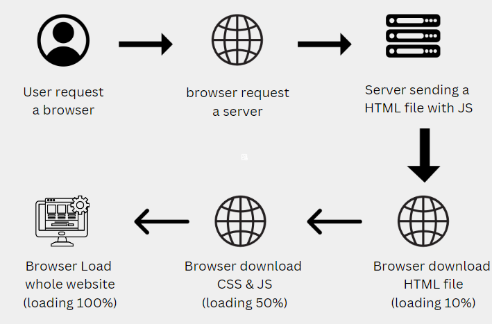

# Rendering:

Rendering converts the code you write into user interfaces. React and Next.js allow you to create hybrid web applications where parts of your code can be rendered on the server or the client.

# Fundamentals of Rendering:

There are three fundamentals concepts of Rendering,

1. Rendering Environments.
2. Request-Response LifeCycle.
3. Network Boundary.

## 1. Rendering Environments:

There are two Rendering Environmennts.

### • Clients

The clients refer to the browser on a user's device that sends a request to a server for your application code.

### • Server

The server refers to a computer in a data center that store your code.

## 

## 2. Request Response LifeCycle:

### • User Action:

The user interacts with your Next.js application, either by typing a URL into their browser or clicking a link. This triggers an HTTP request to the Next.js server.

### • HTTP Request:

The client sends an HTTP request to the server that contains necessary information about what resources are being requested, what method is being used (e.g. GET, POST), and additional data if necessary.

### • Server:

The server processes the request and responds with the appropriate resources. This process may take a couple of steps like routing, fetching data, etc.

### • HTTP Response:

An HTTP response is the server's reply to your web request. It includes a status code (success or error), and the requested resources like HTML, CSS, and JavaScript to build the web page you see.

### • Client:

The browser breaks down received data (HTML, CSS, JS) into its building blocks, then assembles them to create the web page you see.

### • User Action:

Once the user interface is rendered, the user can interact with it, and the whole process starts again.

---

## 3.Network Boundary:

Imagine your React application as a house with two main areas:

- **The Client-Side (Browser):** This is like the living room of your house. It's where users interact with the application, see the UI, and provide input.
- **The Server-Side:** This is like the kitchen of your house. It's where data is fetched, calculations are performed, and server-side rendering happens (if applicable).

**The network boundary** represents the separation between these two areas. It defines where React components are executed and how they interact with each other:

**Types of Network Boundaries (in frameworks like Next.js):**

1. **Server Components (Next.js):** These components reside on the server and handle complex logic or data fetching. They generate the initial HTML structure of your application, including placeholders for Client Components.
2. **Client Components (Next.js):** These components live in the user's browser and handle interactivity. They are responsible for updating the DOM (Document Object Model) and creating a dynamic user experience.
---

# Types Of Rendering

There are two types of rendering Client side renderng & Server side Rendering.

## Client side Rendering:

Client side rendering refers to the process where our application is rendered on client side, meaning that the data is delevered from the server to client side in to HTML, then the page is show to the user.

This image illustrates the process of loading a website in a browser:

### 1. User requests a browser:

A user initiates a request to open a web browser.

### 2. Browser requests a server:

The browser sends a request to the server to retrieve the content of a particular web page.

### 3. Server sending an HTML file with JS:

The server responds to the browser's request by sending back an HTML file along with JavaScript (JS) code. This HTML file contains the basic structure of the web page, while the JavaScript adds interactivity and functionality to the page.

### 4. Browser downloads HTML file (loading 10%):

The browser begins downloading the HTML file sent by the server. The loading progress is indicated as 10%.

### 5. Browser downloads CSS & JS (loading 50%):

While the HTML file is being downloaded, the browser also starts downloading any CSS and JavaScript files referenced in the HTML. These files are necessary for styling the web page and adding interactivity. The loading progress for CSS and JS files is indicated as 50%.

### 6. Browser loads whole website (loading 100%):

Once all the necessary files (HTML, CSS, and JS) are downloaded, the browser starts rendering the entire website. As the rendering process progresses, the loading progress reaches 100%, indicating that the website is fully loaded and ready for interaction.

### DisAdvantages of CSR:

- When JavaScript code is sent from the server, it significantly impacts SEO because HTML tags and content play a crucial role in improving SEO.
- When new data is added, our JavaScript file and bundle will grow, which can slow down our website speed.
- Security issues such as exposing secret APIs, keys, passwords, and sensitive information are not recommended in client-side rendering (CSR) as it is generally less secure. There are increased chances of hacking due to the visibility of sensitive data in client-side code.

## Server side Rendering:

Server-side rendering involves loading data on the server and rendering the entire application in the browser by generating HTML in response to requests made from the browser.

### Advantages of SSR

The benefits of server-side rendering include:

#### 1. Improved Initial Page Load Time:

Server-side rendering reduces the initial page load time by generating HTML on the server and sending it to the client, allowing users to see content more quickly.

#### 2. Enhanced SEO:

Server-side rendering improves search engine optimization (SEO) by ensuring that search engine crawlers can easily index the content of web pages, leading to better visibility in search results.

#### 3. Better Performance on Low-powered Devices:

Since server-side rendering generates HTML on the server, it reduces the amount of processing required on the client-side, resulting in better performance on low-powered devices or slower internet connections.

#### 4. Support for Social Media Sharing:

With server-side rendering, web pages can be fully rendered on the server before being shared on social media platforms, ensuring that shared links display correctly and contain relevant content.

#### 5. Progressive Enhancement:

Server-side rendering allows for progressive enhancement by ensuring that the core content of the web page is accessible even if JavaScript is disabled or not supported in the browser.

#### 6. Easier Debugging and Testing:

Server-side rendering simplifies debugging and testing processes since rendering occurs on the server, making it easier to identify and fix issues related to page rendering and content delivery.

---

## Types of Server Side Rendering :

There are two types of server side rendering.

### 1. Server Side Static Generation (SSG):

Static Site Generation (SSG) is a technique where web pages are generated at build time as static HTML files. These HTML files represent the content of the website and can be served directly to clients. SSG is ideal for websites with content that doesn't change frequently, such as landing pages, blogs, or documentation sites.

#### Advantages of SSG:

• `Fast page load:`
HTML page generated at build time, so when a user visits the static page, it can be quickly loaded.

• `Better Seo:`
Static pages include all necessary content, including meta tags, which is good for search engine optimization.

• `Achieve High Ranking:`
Helps in achieving higher ranking in search results.

• `Easy to scale:`
SSG website are easy to scale because they don`t required server side data fetching at run time. This make them suitable for website with high traffic.

• `Improve Security:`
SSG wesite are mostly static files, they have lower security risk compare to traditional website.

#### DisAdvantages of SSG:

• `Slow updates:` If a page needs to be updated, it has to be manually rebuilt. Change in dynamic data could result in slow updates.

• `Not suitable for dynamic data:` Static generation is not suitable for websites with frequently changing data, such as e-commerce websites or
real-time dashboards.

### 2. Server side Dynamic Rendering (SSR):

Dynamic rendering is the method of generating HTML pages dynamically on the server side in response to each request. This process occurs when a user makes a request to the server, triggering the generation of the HTML page on the server-side, which is then served to the user. Unlike static rendering, where HTML pages are pre-generated, dynamic rendering involves rendering both client and server components at the time of the request, without caching the result. This approach is beneficial for applications such as news websites, personalized e-commerce pages, and social media feeds, where real-time updates and dynamic content are essential.

#### Advantages of Server-Side Dynamic Rendering:

• `Real-Time Data Integration:` Server-side dynamic rendering allows for the integration of real-time data from databases, APIs, or external sources,ensuring that users receive the most up-to-date information.

• `Flexible Content Management:` With server-side rendering, content management systems (CMS) can dynamically generate and serve customized content to
users based on various criteria, providing flexibility in content
presentation.

• `Improved SEO:` Server-side rendering ensures that search engine crawlers receive fully rendered HTML content, leading to better indexing and
improved search engine optimization (SEO) performance compared to client-side rendering.

#### Disadvantages of Server-Side Dynamic Rendering:

• `Performance Overhead:` Server-side dynamic rendering may introduce performance overhead, especially for complex web applications, as it requires processing on the server before delivering fully rendered HTML to the client, potentially leading to slower page load times.

• `Server Load:` Handling dynamic rendering on the server can increase server load, particularly during peak traffic periods, which may require additional server resources and infrastructure scaling to maintain performance and reliability.

• `Caching Challenges:` Dynamic content generated on the server may be challenging to cache effectively, as it often varies based on user interactions or other dynamic factors, complicating caching strategies and potentially impacting overall performance optimization efforts.

### Incremental Static Regeneration (ISR):

Incremental Static Regeneration is a feature in Next.js that allows you to update static pages with new data without having to rebuild the entire site. It works by regenerating specific pages when new data is available, rather than regenerating the entire site. This approach improves efficiency and reduces the time it takes to update content, making it ideal for dynamic websites with frequently changing data.

#### Advantages Of ISR:

• `Improved Performance:` ISR allows you to serve static content initially while regenerating it in the background. This means your users get fast page loads while ensuring that your content stays up to date.

• `Dynamic Content Updates:` With ISR, you can have dynamic content on your static site. The pages are regenerated periodically or upon request, ensuring that your content is always fresh without sacrificing performance.

• `Reduced Load on Servers:` By serving static content whenever possible and regenerating it incrementally, ISR reduces the load on your servers. This is particularly beneficial for sites with high traffic volumes as it helps maintain performance and scalability.

• `Better User Experience:` Users get a consistently fast experience, even when content changes frequently. They don't have to wait for pages to rebuild before accessing the latest information, which enhances overall user satisfaction.

• `SEO Benefits:` Static content is easily crawlable by search engine bots, helping to improve SEO rankings. With ISR, you can have the best of both worlds: dynamic content for users and static content for search engines.

• `Control Over Regeneration:` Next.js allows you to configure ISR based on your needs. You can specify how frequently pages should be regenerated and whether regeneration should be triggered by user requests or on a schedule.

---

# Streaming:

Streaming refers to a technique that breaks down the process of delivering a web page from the server to the client into smaller chunks. This allows the user to see parts of the page sooner, improving the perceived performance of your application.

Here's a breakdown of how streaming works in Next.js:

**Traditional Server-Side Rendering (SSR):**

- The entire page is rendered on the server in one go.
- Once everything is ready, the server sends the complete HTML response to the client's browser.
- The browser then displays the page only after it receives the entire response.

**Streaming in Next.js:**

1. **Chunking:** Next.js breaks down your page into smaller units based on routes (URL segments) or Suspense boundaries (React components that can delay rendering until data is available).
2. **Progressive Delivery:** The server starts sending these chunks to the browser as soon as they are ready, without waiting for the entire page to be rendered.
3. **Partial Rendering:** The browser can start rendering the page as soon as it receives the first chunk of HTML. This allows users to see the content of the page sooner, even if some parts are still loading.
4. **Hydration:** Once the browser receives all the chunks, it hydrates the Client Components (those that rely on interactivity) with JavaScript code, making the page fully interactive.

**Benefits of Streaming in Next.js:**

- **Faster Perceived Performance:** Users see content sooner, leading to a more responsive experience. This is especially helpful for pages with a lot of content or that take time to fetch data.
- **Improved SEO:** Search engines can still index the content of the page because the initial chunk includes the relevant information.
- **Efficient Use of Network Resources:** Streaming avoids sending the entire page at once, which can be beneficial for users on slower connections.

---

# Server and Client Components:

Server and Client Components enable developers to create applications that operate across both the server and client sides. This approach combines the interactive features of client-side applications with the enhanced performance of conventional server rendering.

Imagine building a web application that's both:

• `Fast and Efficient:` Delivers initial content quickly, thanks to server-side rendering.

c `Highly Interactive:` Provides a smooth and engaging user experience with dynamic updates on the client-side.

That's the magic of Server and Client Components!

## Server Comnponents :

In the world of web development, performance is king. Users expect websites to load quickly and deliver a seamless experience. But achieving this can be challenging, especially when dealing with large dependencies like libraries or third-party code. This is where Server Components (RFC) come in as a game-changer.

Traditionally, these dependencies had to be bundled into the JavaScript code that runs on the client-side (your browser). This meant that the browser had to download and process all that code before the app could even start loading. This could lead to slow loading times and a sluggish user experience.

Server Components (RFC) address this issue by allowing developers to keep large dependencies on the server. This means that the browser only needs to download a smaller amount of code, resulting in significantly faster loading times. Additionally, Server Components can improve overall performance by offloading some of the processing work from the client-side to the server-side.

By default, Next.js uses Server Components. This allows you to automatically implement server rendering with no additional configuration.

## Client Comnponents :

In Next.js applications, Client Components offer a way to build highly interactive and dynamic user interfaces that leverage the power of the client-side (your user's browser). They're ideal for elements that require user interaction, state management, or real-time updates.

**When to Use Client Components:**

- **Interactive Elements:** Client Components are perfect for creating interactive UI components like dropdowns, forms, real-time chat interfaces, and more.
- **State Management:** They're well-suited for scenarios where you need to manage state that's specific to a particular client session or requires user interaction.
- **Third-Party Libraries:** If you're using client-side libraries that rely on browser APIs or window objects, Client Components provide the ideal environment.

**Optimizing for Performance:**

- **Minimal "use client":** Only mark components as Client Components if they truly require client-side functionality using hooks like `useState` or `useEffect`. This ensures you keep the client-side JavaScript bundle as small as possible, improving initial load times and overall performance.
- **Server-Side Rendering Whenever Possible:** For components that don't require direct user interaction or client-side hooks, leave them without the `'use client';` directive so they can benefit from Next.js's automatic server-side rendering, leading to a faster initial experience.

## How are Server & Client Components Rendered?

Imagine you're building a website with Next.js. Here's what happens when a user requests a page:

**On the Server (Muscle):**

1. **Chunk It Up:** Next.js breaks down your pages into smaller parts based on routes (like URLs) and Suspense boundaries (special React features for handling loading states).
2. **React Does Its Thing:** React takes each chunk of your page and uses its rendering magic to turn it into a special format called the "React Server Component Payload" (RSC Payload). Think of this as a blueprint for the page.
3. **Next.js Takes Over:** Next.js combines the RSC Payload with instructions for interactive parts (Client Components) to generate the initial HTML for the page. This HTML is like a basic outline – it shows the page structure but isn't interactive yet.

**To the Client's Browser (Brain):**

1. **Fast Preview:** The browser receives the initial HTML and displays a quick, non-interactive version of the page. This gives the user something to see while the rest loads.
2. **Reconciliation Time:** The browser uses the RSC Payload to compare the server-rendered version with any interactive Client Components. It then updates the page's structure (DOM) accordingly.
3. **Hydration for Interactivity:** The browser uses the Client Component instructions (JavaScript) to "hydrate" them and make them interactive. This is where your buttons, forms, and other dynamic elements come to life.

---

# Hydration:

In Next.js, hydration refers to the process of transforming a static HTML page, generated on the server during rendering, into a fully interactive React application in the user's browser. Here's a breakdown:

**1. Server-Side Rendering (SSR):**

- Next.js uses React to render your page components on the server. This creates an initial HTML structure with the content and layout.
- However, this HTML doesn't include any interactivity because it lacks the JavaScript code for React components.

**2. Hydration Comes In:**

- Once the HTML reaches the user's browser, the JavaScript code for Client Components (components that rely on browser APIs or user interaction) is also downloaded.
- Hydration uses this JavaScript code to "attach life" to the pre-rendered HTML. It essentially:
  - Injects event listeners into the existing HTML elements. These event listeners enable user interactions like button clicks, form submissions, etc.
  - Reconciles any potential mismatches between the server-rendered HTML and the client-side React component tree.
  - Makes your Next.js application fully interactive.

**Benefits of Hydration:**

- **Faster Initial Load:** Users see the static content of the page quickly because it's already rendered on the server.
- **Improved SEO:** Search engines can easily understand and index the content from the initial HTML.
- **Seamless Transition:** As the JavaScript code loads, the user experience feels smooth as the page becomes interactive.

## Hydration Error:

A hydration error occurs when there's a mismatch between the initial HTML structure rendered on the server (during Server-Side Rendering or SSR) and the HTML structure that React expects to create on the client (during hydration). This mismatch prevents React from correctly attaching event listeners, managing component state, and ultimately, making the application fully interactive.

### Causes of Hydration Errors:

• `Incorrect Nesting:` HTML elements should be nested correctly. For example, you can't nest a `
` tag inside another `
` tag.

• `Interactive Elements Nesting:` Certain elements like `<a>` (anchor) or `<button>` cannot be nested within each other. They should be directly nested within a non-interactive element.

• `Server-Side Logic Errors:` Conditional rendering or data manipulation on the server-side that leads to different HTML structures on the client can cause hydration errors.

[Rendering](https://nextjs.org/docs/app/building-your-application/rendering)

[Hydration](https://youtu.be/vCOSTG10Y4o?si=fRSDNT6bv7tCE0pe&t=7116)

[Streaming](https://www.youtube.com/watch?v=QH1Cipdjr60v)

[Streaming](https://www.youtube.com/watch?v=gZbjVz0M5x0)

[Article1](https://medium.com/walmartglobaltech/the-benefits-of-server-side-rendering-over-client-side-rendering-5d07ff2cefe8)

[Article2](https://www.linkedin.com/pulse/avoiding-hydration-errors-nextjs-technical-guide-ali-hamza/)

[Article3](https://medium.com/gitconnected/client-side-rendering-react-vs-server-side-rendering-nextjs-03c4b81c25ab)

[Article4](https://www.linkedin.com/pulse/comparing-nextjs-server-side-rendering-ssr-vs-static-site-pankaj-yyhjc/)
